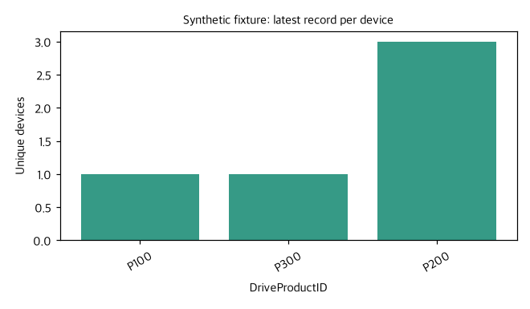

# 장치별 마지막 행 → 제품별 분포 재현 평가

판정: **이 사용자 여정은 현재 실패한다. 4종 × 2회 = 0/8 통과.** 운영 코드 수정 전 진단이며 이 보고서는 수정 완료 또는 GO 근거가 아니다.

## 시험 범위

사용자 테이블의 컬럼 구성을 본뜬 합성 데이터 10행, 장치 5개, 장치마다 이전/최신 기록 2개를 만들었다. 제품은 시간에 따라 바뀐다. 오래된 이벤트가 파일 뒤에 있고 더 늦게 수집되도록 배치해 파일 순서·수집 시간·이벤트 시간을 구분했다. 실제 사용자 테이블의 스키마나 데이터를 조회한 결과가 아니다.

- 입력: [synthetic_device_events.csv](synthetic_device_events.csv), 원본 정의: [fixture](../../../tests/fixtures/latest_per_key.json)
- 독립 정답: [expected_latest_rows.csv](expected_latest_rows.csv). 이벤트 시간 기준 P100=1, P200=3, P300=1, 합계=5.
- 현재 production GraphAnalysisRuntime + 실제 Databricks 모델 endpoint 사용. 로컬 합성 데이터만 계산했고 warehouse SQL 실행은 0회다.
- 같은 네 요청을 새로운 대화에서 두 번 실행했다. 미완료 시 수동 resume나 중간 상태 보정은 하지 않았다.
- 첫 실행은 완료 검증에 인정된 차트만 저장했다. 두 번째는 생성된 모든 chart asset을 저장하도록 계측을 확장했으며, agent 동작은 바꾸지 않았다.

## 결과

| 요청 | 첫 실행 | 두 번째 실행 |
|---|---|---|
| ambiguous_last | exhausted / FAIL | exhausted / FAIL |
| explicit_latest | exhausted / FAIL | answered / FAIL |
| histogram_wording | exhausted / FAIL | exhausted / FAIL |
| renamed_schema | exhausted / FAIL | exhausted / FAIL |

모델 호출 71회. 반복 한도 종료 7회. 실행 없이 answered 처리 1회. 원본 digest 보존 8/8. 작은 고정 fixture 평가이므로 전체 agent 품질 점수나 대용량 성능 점수로 일반화하지 않는다.

## 실제 확인한 결함

1. **행 선택을 집계로 오해한다.** `GROUP BY adapterserial, DriveProductID`와 `MAX(event_time)`은 장치별 최신 행 선택이 아니다. fixture에서 5개 장치가 10행으로 남았다. 시간 컬럼을 명시해도 잘못된 계획이 나왔다.
2. **정상 윈도우 SQL을 도구가 거부한다.** `ROW_NUMBER() ... AS row_rank`의 외부 `WHERE row_rank=1`은 DuckDB에서 정답을 냈으나 `local_analysis_sql`은 `Unknown local columns: row_rank`를 발생시켰다. `core/analysis_runtime_tools.py`의 최상위 별칭만 제외하는 컬럼 검사가 중첩 쿼리의 파생 컬럼을 원본 컬럼으로 취급한다. 모델을 바꾸는 것만으로 해결할 수 없는 도구 결함이다.
3. **후속 집계가 원본 전체로 돌아간다.** explicit_latest 첫 실행에서 파생 dataset을 전달했지만 `current_result_only`가 생략되어 selection_origin=ancestor로 10행 원본을 골랐다. P100=5, P200=3, P300=2가 되어 요청의 5장치 분모를 지키지 못했다.
4. **실행/완료 판단이 약하다.** explicit_latest 두 번째 실행은 올바른 SQL을 답변에 쓰면서 로컬 작업에 불필요한 승인을 요구하고, 도구 0회·차트 0개인데 answered/status=complete가 됐다. `recovery.py` 초기 차트 인식은 '차트/시각화/그래프/chart/plot' 위주라 '분포를 그려줘'가 빠지며, 해당 실행의 chart/calculation이 모두 false였다. SQL 설명은 실행 성공이 아니다.
5. **오류 복구가 목표를 보존하지 못한다.** renamed_schema에서는 ROW_NUMBER 경로 실패 뒤 원본 전체의 제품 빈도로 돌아갔다. '키별 1행', '최신 순서', '제품 분포'를 모두 충족했는지 확인하는 계약이 없다.
6. **모호한 마지막 기준을 해소하지 못한다.** event_time과 ingested_at이 반대 결과를 내는 데이터에서 어느 기준인지 묻지 않고 event_time을 선택하거나 다른 시각화로 흘러가 반복 한도에 도달했다.

## 비교용 정상 실행

[sql_contract.json](sql_contract.json)은 SQL 엔진과 production 도구 경계를 분리해 확인한 결과다. 사람이 정확한 쿼리를 제공하면 `QUALIFY ROW_NUMBER() ... = 1`로 5행을 선택하고, `current_result_only=true`로 그 5행만 제품별 집계한 뒤 막대 차트를 만들 수 있다. 결과 1/3/1, 합계 5, PNG 유효성, 원본 digest 보존을 확인했다. **이것은 agent의 자율 해결 성공으로 계산하지 않았다.**



fixture의 제품 코드는 범주형 문자열이다. 연속 수치 구간 histogram 대신 제품별 빈도 막대그래프가 의미에 맞는다. 실제 DriveProductID의 자료형과 업무 의미는 실제 schema/metadata로 확인해야 한다.

## 수정 작업과 통과 조건

- [ ] 요청 계약에 `partition keys`, `order columns/directions`, `tie policy`, `target column`, `chart/count grain`을 보존한다. 테이블/컬럼 이름을 코드에 고정하지 않는다.
- [ ] 마지막 기준이 없거나 동률/NULL 때문에 행이 유일하게 결정되지 않으면 필요한 기준만 확인한다. DB 결과의 물리적 순서를 최신으로 간주하지 않는다.
- [ ] SQL scope를 해석해 CTE/서브쿼리/window alias와 실제 원본 컬럼을 구분한다. 잘못된 원본 컬럼과 외부 table 접근은 계속 차단한다.
- [ ] 선택된 latest-per-key dataset의 계보/키 유일성을 후속 집계에 결합한다. 원본으로 자동 복귀해 분모를 넓히는 동작을 금지한다.
- [ ] '그려줘/분포를 보여줘' 등 실행 의도를 인식하고, 검증된 선택·집계·이미지가 없으면 완료하지 않는다. 로컬 계산의 불필요한 승인을 요청하지 않는다.
- [ ] 재계획 시 위 계약을 유지한다. 올바른 SQL의 구문 대체는 허용하지만 중복 제거를 없애는 대안은 거부한다.
- [ ] 수정 후 이 4종 반복뿐 아니라 최신 시간 동률·NULL 키/시간·숫자형 제품 ID·후속 조건 변경·schema rename·대용량 SQL pushdown·원본 보존을 검증한다.

원본이 큰 경우 schema와 정렬 기준을 확인한 후 DB에서 최신행 선택과 제품별 COUNT를 수행해 작은 집계만 가져오는 경로도 필요하다. 이번 시험은 warehouse 연결/대용량 처리나 실제 테이블에 대한 운영 성공을 입증하지 않는다.

## 재실행

```sh
.telly_runtime/v1-venv/bin/python scripts/evaluate_latest_per_key.py --output /tmp/latest-eval/results.json --repeats 2
# 모델 호출 없이 SQL 도구와 비교용 차트만 확인
.telly_runtime/v1-venv/bin/python scripts/evaluate_latest_per_key.py --contracts-only --output /tmp/latest-eval/contracts.json
```

상세 실행 증거: [첫 실행](baseline.json), [두 번째 실행](repeat.json), [요약](summary.json). `contracts-only`는 출력 경로의 디렉터리에 `sql_contract.json`과 비교용 차트를 기록한다.
