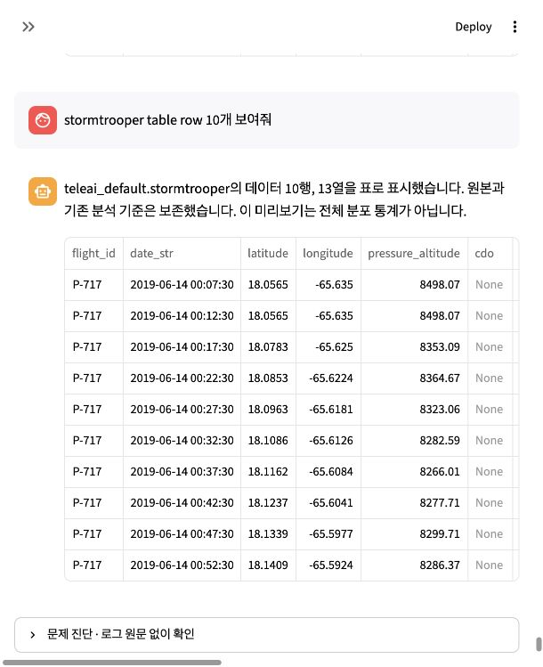

# 행 미리보기 요청이 테이블 목록을 반환한 오류

2026-10-05, 기존 MySQL 개발 웹 대화에서 원인 확인·수정·실제 검증을 완료했다.

## 원인

실패 run `808085c6a29647cc86f8e81101461284`의 모델 호출은 **0회**였다. LLM의 SQL 생성이나 데이터베이스 응답 실패가 아니다. 행 미리보기 파서가 숫자 다음 행 단위인 `10행`은 인식하지만 `row 10개` 순서는 인식하지 못했다. 그 뒤 넓은 `table … 보여줘` 규칙이 테이블 목록 요청으로 분류했다.

실제로 실행한 SQL은 stormtrooper 행 조회가 아니라 `information_schema.tables`에서 teleai_default의 테이블 목록을 조회하는 SQL이었다. 7행 수신은 정상이다. 잘못 해석된 테이블 목록 계약을 만족했기에 완료로 판정했다. 요청 의미 분기 단계의 오류다.

## 수정

- `core/analysis_agent/row_preview.py`: 숫자→단위와 단위→숫자 순서를 함께 인식한다. row/rows/record/records/레코드/행, 띄어쓰기 생략과 한국어 조사를 처리한다. 기존 1~200행 제한과 차트·집계 제외를 유지한다.
- `core/analysis_agent/remote_completion.py`: 행·레코드 요청을 테이블 목록 의도에서 제외한다. 영문 table 뒤 한국어 조사도 인식한다. row_id/records_archive 같은 식별자 조각을 행 의도로 쓰지 않는다.
- `tests/test_row_preview.py`: 일반 테이블 observations로 표현 순서·조사·목록 요청·잘못된 개수·식별자 음성 사례를 추가했다. 기존 MySQL/Databricks dialect 실행 및 원본 보존 시나리오에도 같은 표현 순서를 추가했다. 특정 운영 테이블 하드코딩은 없다.

## 실제 웹 검증

같은 사용자 대화와 정확히 같은 요청을 사용했다.

| 구분 | 결과 |
| --- | --- |
| 첫 요청 | `teleai_default.stormtrooper` 10행·13열, native 데이터 표 표시 |
| 실행 SQL | `SELECT * FROM \`teleai_default\`.\`stormtrooper\` LIMIT 10` |
| 첫 요청 시간/모델/SQL | 0.230초 / 0회 / 1회 |
| 동일 요청 반복 | 동일 저장 데이터의 10행·13열 표 표시 |
| 반복 시간/모델/SQL | 0.248초 / 0회 / 0회 |
| 데이터 보존 | 기존 34개 자산 metadata/payload SHA-256 모두 동일, 분석 선택 동일 |
| 새 자산 | stormtrooper 10행 데이터 1개만 추가 |

첫 성공 run `9d624b37563e43afb8d37136145dd8a7`, 반복 run `0e760093bd1b47bdbacfece76fcc755f`. 반복 checkpoint의 출처·스냅샷·13컬럼·10행 표 증거가 새 데이터 ID와 일치한다. 실제 MySQL 검증이며 Databricks live 검증으로 계산하지 않는다. LIMIT 미리보기는 전체 분포나 정렬된 첫 10행을 의미하지 않는다.

## 회귀와 한계

최종 관련 검사 **31 passed / 15 subtests passed**, 전체 `pytest tests migration -q` **733 passed / 4 skipped / 509 subtests passed, 107.69초**. 최초 변경에서 경계 정규식 때문에 기존 숫자→단위 표현이 실패한 결과도 `regression_initial.txt`로 보존했다. 최종 수정 후 전체 회귀를 다시 통과했다. 이 결과는 이번 행 미리보기 의도 오류의 검증이며 모든 자연어 분석과 출시 GO를 뜻하지 않는다.

8504 서버는 최신 코드로 재시작해 health `ok`, MySQL 개발환경 유지. `.env`의 Databricks 기본값은 변경하지 않았다. commit/push는 수행하지 않았다.

근거: `original_failure.json`, `before.json`, `web_execution.json`, `reuse_proof.json`, `validation.json`, `related_final.txt`, `regression_final.txt`, `final_web.png`.
