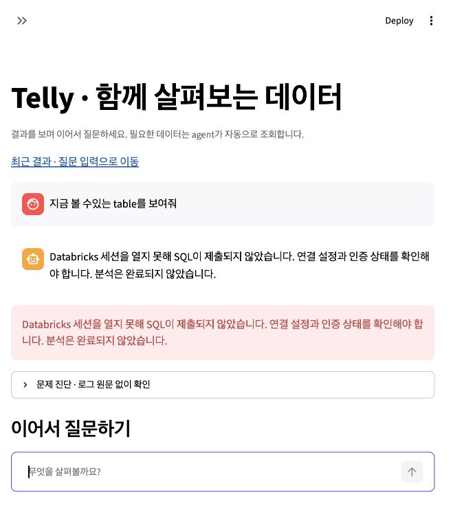

# Databricks · prompt_konlo_test_scenario_#1 평가

2026-10-08 KST. **판정: 외부 DB 실행 차단 / 점수 산정 불가.** 31개 전체 평가 완료나 agent 품질 0점으로 표시하지 않는다.

`.env`의 `TELLY_DATA_BACKEND=databricks`를 저장하고8504 서버를 다시 실행했다. Ollama/qwen3:8b 모델은 이전MySQL 평가와 동일하다. 실제 웹의 데이터 소스도Databricks로 확인했다. 새 대화 `baf56db1-4e39-4650-af22-e40760725253`에서 첫 원문만1회 제출했다.

| 점검 | 실제 결과 |
| --- | --- |
| 설정된 웨어하우스 조회 / 목록 API | HTTP200 · STOPPED · 설정 ID와 목록 ID 일치 |
| SQL connector SELECT1 | OpenSession HTTP400 · SQL 제출 전 실패 |
| 독립 Statement API SELECT1 | HTTP400 · The request could not be processed by the warehouse. |
| 웨어하우스 시작 요청 | HTTP400 · Cannot create the resource, please try again later. |
| 챗봇 첫 원문: 지금 볼 수있는 table를 보여줘 | table_list 의도 해석, 조회 실행 시도 후 remote_blocked |
| 나머지30개 | DB 선행 조건 실패로 NOT_RUN |

첫 실행 ID `4d354ec8508b4e2f8b1548a915260c1f`, 오류 ID `df13544169e9`. 29.427초, 모델2회. 웹은 “Databricks 세션을 열지 못해 SQL이 제출되지 않았습니다”라고 표시했고 조회 완료를 주장하지 않았다. 신규 데이터/이미지0개. 첫 실패는 LLM SQL 생성 단계가 아닌 세션/웨어하우스 단계다. 인증된 관리 조회200만으로 SQL 연결이 정상이라고 판단하지 않는다. 이번 근거만으로400이 일시 장애인지, 계정 사용 한도인지, 서비스 자원 문제인지는 확정할 수 없다.

31개 원문/순서/체크섬을 보존했다. 29/31번의MySQL 한정명 `teleai_default.bank_loan`은 Databricks의 `workspace.default`와 다르므로 이후에도 원문을 조용히 바꾸지 않고 출처 처리의 정확성을 별도로 평가해야 한다. SSD 테이블 존재 여부도 아직 확인되지 않았다.

기존62개 scope의 자산/선택 hash 대조 결과 변경0. MySQL 평가 결과와 자산을 보존했다. 제품 코드 수정, commit/push, 모델 제공자 변경 없음.

다음 실행 조건: 설정된 웨어하우스 시작 및SELECT1 성공. 충족 후 새 대화에서31개 전체를 처음부터 실행하고 실제 DB 결과·조건·출처·PNG·UI·보존을 대조한다. Databricks 실측 점수는 미산정이며 이전MySQL54.8%를 재사용하지 않는다.

근거: `connection_probe.json`, `warehouse_probe.json`, `control_probe.json`, `01.json`, `ui.txt`, `preservation_check.json`, `report.json`.

