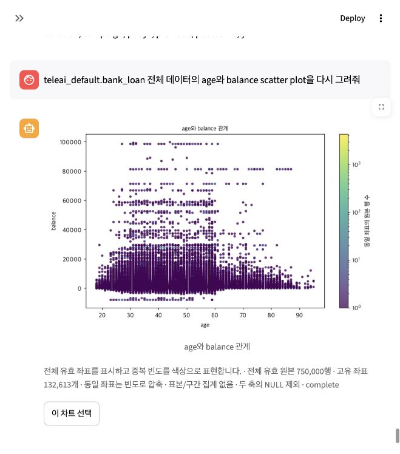
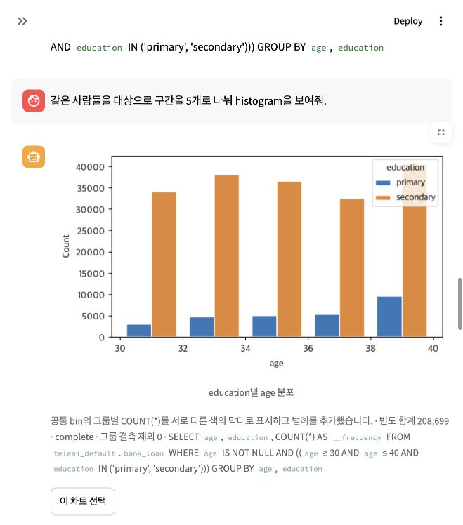
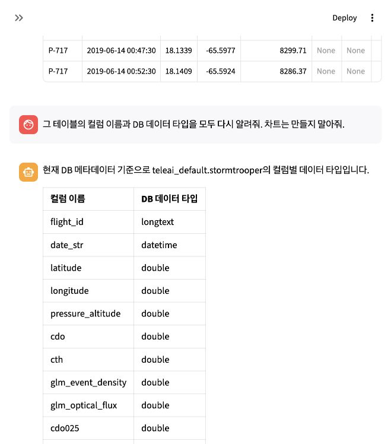

# 실제 프롬프트 최종 평가 — 2026-10-09

**판정: 로컬 MySQL + Ollama의 지정된 기본 EDA 사용자 여정은 검증 통과. 단일 사용자 loopback 환경에서 사용 시험 가능. 범용·회사 운영 GO는 미검증이다.**

기존 사용자 원문 `prompt_konlo_test_scenario_#1` 31개와 `prompt_ai_test_scenario_#1` 10개를 서로 다른 새 대화의 실제 웹 입력창에 순차 입력했다. 같은 최종 제품 코드를 고정하고 최초 제출만 채점했으며 질문 재제출·제품 수정·수동 SQL 대체·정답 주입은 없었다. 모델 답변 문구나 내부 완료 상태만으로 통과 처리하지 않았다.

| 평가 | 결과 | 응답 중앙값 | 최대 |
| --- | --- | --- | --- |
| 기존 사용자 31문항 | 31/31 PASS | 44.897초 | 65.407초 |
| 추가 표현 10문항 | 10/10 PASS | 40.2765초 | 61.431초 |

31문항 중 29건은 요청한 결과 출력, 2건은 실제로 없는 테이블의 이름을 유지한 정확한 안내다. 41건을 모두 분석 성공 41건으로 해석하지 않는다. 이전 실패한 평가 묶음은 남겨 두었으며 최종 점수에 합산하지 않았다.

## 독립 대조와 실제 화면

- 현재 DB 테이블 7개 및 bank_loan 18개·stormtrooper 13개 컬럼을 실제 메타데이터와 비교했다. 마지막 요청은 13개 **컬럼 이름과 DB 타입을 모두 실제 표로 표시**했다. DataFrame 저장 타입과 DB 타입을 혼동하지 않았다.
- 전체 bank_loan 750,000건, primary·30~40세 27,439건, primary/secondary·30~40세 208,699건을 독립 SQL 정답과 비교했다.
- 산점도는 조건부 35,294개 좌표/208,699건, 전체 132,613개 좌표/750,000건을 좌표·빈도 hash로 비교했다. 중복 좌표만 빈도로 압축했으며 표본을 전체라고 보고하지 않았다.
- 직전 education 값을 요청 대상에서 유지하고, 조건 추가/해제, 컬럼 확인을 사이에 둔 후속 분석, 다른 테이블 전환, 10행 결과와 전체 모집단을 구분했다.
- 범례·고대비·한 개 누적 막대, 5개 histogram 구간을 실제 PNG와 화면으로 확인했다. 차트 편집(원문8~14)·표시10행 그림(22)·5구간 재조정(AI7)은 추가 분석 SQL 0회였다. 서비스의 카탈로그/스키마 관찰 쿼리는 이 집계와 별도다.
- 41개 실제 입력과 현재 요청에 붙은 이미지/표/본문을 DOM으로 별도 채점했다. 내부 schema 증거만으로 타입 출력의 성공을 인정하지 않는다.
- 최종 두 평가의 코드 hash 동일, 실행 중 제품 코드 변경 0, 기존 결과 내용/메타데이터 변경 0, 이 평가에 발행된 자산 소실 0. 이는 발행 결과의 보존 검사이며 실제 전체 원본 75만행을 raw로 로딩한 시험은 아니다.







## 공통 원인과 보강

출처와 컬럼을 혼동하거나 과거 결과를 새 요청의 대상으로 삼는 문제, 동일 출처의 범위 누락, 추가 범주 해석 누락, 그룹 histogram의 OR 조건 누락, 타입을 이름만 출력하는 작업으로 축소하는 문제가 있었다. 테이블별 예외 대신 독립 LLM의 출처·작업·축/그룹·모집단·출력 종류를 typed 계약에 연결하고 상세 계획과 실행 결과가 이를 보존하도록 검증했다. AND/OR 범위를 SQL 전체에 전달하며 기존 집계 재사용을 검증한다. 최종 dtype 답변은 이름+타입 표를 렌더링한다.

`...ai10_boolean`의 최초 checkpoint-only 10/10은 실제 화면의 타입 누락 발견 후 **9/10으로 정정**했다. 최종 `...ai10_output`은 모델이 dtypes를 선택하고 실제 표 출력까지 확인하여 통과했다. 최종10번 checker의 최초 FAIL은 도구 checkpoint에서 최종 답변이 아직 저장되지 않은 시점의 제한 transcript를 검사한 평가기 문제였다. 실제 DOM 증거로 정정했고 원기록을 보존했다. 원문25번의 두 공백은 Markdown 화면에서 한 공백으로 표시되므로 UI 대조에서만 공백 표시를 정규화했다. 원래 입력과 checkpoint 요청은 원문 그대로 대조한다.

## 회귀와 대규모 처리 근거

전체 unittest 718건: 714 PASS/4 opt-in MySQL SKIP (217.238초). 이어서 opt-in 실제 MySQL 4건 모두 PASS (62.634초). 합쳐 서로 다른 718건을 실행했고 같은 검사를 두 번 합산하지 않았다. 전체 compile·pip check·git diff 검사를 별도 수행한다. [회귀 로그](unit_regression.log), [실제 MySQL 로그](live_mysql.log).

합성 100만행 검사에서 실제 ingestion/영속 저장/재시작/원본 보존·전송 실패·quota 계약을 확인했다. 이는 합성 cursor 시험이며 실제 MySQL 100만행 네트워크 로딩, 61GB fresh scan 또는 광범위 성능 합격의 근거가 아니다. [합성 검사](../2026-10-09_mysql_go_axes/synthetic_million_rows.json). 실제 이번 DB 검증은 75만행 SQL pushdown/가중 좌표와 후속 EDA 재사용이다.

## 남은 범위

회사 Windows/Azure/Databricks 실행, 미채점 표현·새 스키마의 고급 다단계 자율 복구, 생성 Python의 격리 실행/수정, 중첩 조건과 작업별 범위/의존성, 실대규모 전송·메모리·전체 deadline·응답 SLA, 공식 DeepEval/Spider2 평가가 남았다. 이번 지정 여정 통과를 Codex/Claude Code 수준의 범용 자율성이나 공식 benchmark 점수로 확대하지 않는다. 별도 서버 구축은 사용자가 제외한 범위다.

두 묶음의 응답 중앙값은 약40~45초, 최대65.407초다. 기능 정확성의 통과와 지연시간 SLA의 수용은 별도이며 합의된 SLA가 없어 속도 합격을 선언하지 않는다.

## 원문별 결과

각 행은 독립 DB/PNG 채점과 실제 UI 출력 검사 모두 통과했다. `SQL`은 해당 요청의 분석 조회 시작 횟수이며 메타데이터 관찰 쿼리는 별도다.

### 기존 사용자31

| 번호 | 원문 | 판정 | SQL |
| --- | --- | --- | --- |
| 1 | 지금 볼 수있는 table를 보여줘 | PASS | 1 |
| 2 | bank_loan 컬럼들을 보여줘 | PASS | 0 |
| 3 | age 의 histogram 그려줘 | PASS | 1 |
| 4 | education은 어떤 값들로 되어 있지 ? | PASS | 1 |
| 5 | histogram을 그려줘 | PASS | 1 |
| 6 | education이 primary 이고 age가 30~40인 사람들을 시각화 해줘 | PASS | 1 |
| 7 | education이 primary과 secondary 이고 age가 30~40인 사람들을 시각화 해줘 | PASS | 1 |
| 8 | 같은 조건을 유지해서 histogram을 다시 보여줘 | PASS | 0 |
| 9 | legend를 넣어서 primary과 secondary 에 따라서 색을 좀 넣어줘, | PASS | 0 |
| 10 | 색 구별이 안 되고 있어 | PASS | 0 |
| 11 | education별 색상 구분과 legend를 넣어줘 | PASS | 0 |
| 12 | 하나의 stack으로 legend를 포함해서 다시 그려줘 | PASS | 0 |
| 13 | stackbin으로 다시 그려줘 | PASS | 0 |
| 14 | 이거 legend를 넣어줘 | PASS | 0 |
| 15 | 테이블의 column 다시 보여줘 | PASS | 0 |
| 16 | 데이타 10개 row만 추출해서 table로 보여줘 | PASS | 1 |
| 17 | age를 x축으로 하고 balance를 Y축으로 하는 scatter plot를 그려줘 | PASS | 1 |
| 18 | age와 balance의 관계를 그려줘봐 | PASS | 0 |
| 19 | 전체 데이타에 대해서 age와 balance scatter plot으로 그려줘 | PASS | 1 |
| 20 | age와 balance 의 scatter plot으로 그려줘 | PASS | 0 |
| 21 | bank_loan 데이터를 10개 row로 보여줘 | PASS | 1 |
| 22 | 방금 보여준 10행 데이터의 age를 x축, balance를 y축으로 scatter plot을 그려줘 | PASS | 0 |
| 23 | 전체 데이타를 이용해서 age와 balance의 관계를 다시 scatter plot으로 그려줘 | PASS | 0 |
| 24 | 내가 볼 수 있는 table 다시 한번 보여줘 | PASS | 1 |
| 25 | _tianchi_ssd_shared300k_import  row 수가 몇개야 ? | PASS | 1 |
| 26 | table 다시 한번 보여줘 | PASS | 1 |
| 27 | tianchi_ssd_shared300k_raw 이 table row 수가 몇개야 ? | PASS | 0 |
| 28 | 이 테이블의 column들을 보여줘 | PASS | 0 |
| 29 | teleai_default.bank_loan 전체 데이타를 이용해서 age와 balance의 관계를 다시 scatter plot으로 그려줘 | PASS | 0 |
| 30 | table column를보여줘 | PASS | 0 |
| 31 | teleai_default.bank_loan 전체 데이터의 age와 balance scatter plot을 다시 그려줘 | PASS | 0 |

[실행·정답 대조 기록](../2026-10-09_mysql_go_konlo_output/report.json) · [실제 화면 출력 검사](../2026-10-09_mysql_go_konlo_output/browser_checks.json)

### 추가AI10

| 번호 | 원문 | 판정 | SQL |
| --- | --- | --- | --- |
| 1 | 지금 연결된 DB에서 분석 가능한 테이블 이름들을 알려줄래? | PASS | 1 |
| 2 | 은행 대출 데이터 bank_loan에는 어떤 컬럼이 들어 있어? | PASS | 0 |
| 3 | 여기 education에 들어있는 값 종류를 전부 알려줘. | PASS | 1 |
| 4 | 방금 확인한 값들이 얼마나 많은지 막대 그림으로 보여줘. | PASS | 1 |
| 5 | education이 primary인 사람 중 나이가 30세 이상 40세 이하인 사람들의 age 분포를 그려줘. | PASS | 1 |
| 6 | 나이 조건은 그대로 두고 secondary도 포함해서 다시 그려줄래? | PASS | 1 |
| 7 | 같은 사람들을 대상으로 구간을 5개로 나눠 histogram을 보여줘. | PASS | 0 |
| 8 | 이제 조건을 전부 없애고 bank_loan 전체의 age를 가로축, balance를 세로축으로 산점도를 그려줘. | PASS | 1 |
| 9 | 이번에는 stormtrooper에서 row 10개만 표로 보고 싶어. | PASS | 1 |
| 10 | 그 테이블의 컬럼 이름과 DB 데이터 타입을 모두 다시 알려줘. 차트는 만들지 말아줘. | PASS | 0 |

[실행·정답 대조 기록](../2026-10-09_mysql_go_ai10_output/report.json) · [실제 화면 출력 검사](../2026-10-09_mysql_go_ai10_output/browser_checks.json)

## 재검사와 현재 실행 상태

현재 앱은 [최종 사용자 여정 화면](http://127.0.0.1:8504/Telly?conversation=47d9aba0-9794-4f38-b171-970350ceef8f)에서 실행 중이다. `TELLY_DATA_BACKEND=mysql`, `LLM_PROVIDER=ollama`, `TELLY_GOAL_MODEL=gemma4:e4b`이며 회사 Azure/Databricks 예제는 별도다. 비밀값은 보고서에 기록하지 않았다.

최종 실제 DOM 증거를 저장한 후 아래 검사로 UI 출력 누락을 다시 채점할 수 있다. 이 명령은 읽기 전용 평가기이며 새 프롬프트 제출을 수행하지 않는다. 새 실행은 저장 시나리오 원문과 새로운 대화/DB 실행 증거를 별도로 수집해야 한다.

```sh
python3 test_set/check_prompt_browser_evidence.py docs/evaluation/2026-10-09_mysql_go_konlo_output
python3 test_set/check_prompt_browser_evidence.py docs/evaluation/2026-10-09_mysql_go_ai10_output
```

평가한 코드는 현재 로컬 작업 트리이며 Git HEAD와 같지 않다. 제품 파일별 hash는 [build.json](build.json)에 기록했다. 이번 요청에서는 commit/push를 하지 않았다. 최종 범위 판정은 [go_gate.json](go_gate.json)에 있다.
