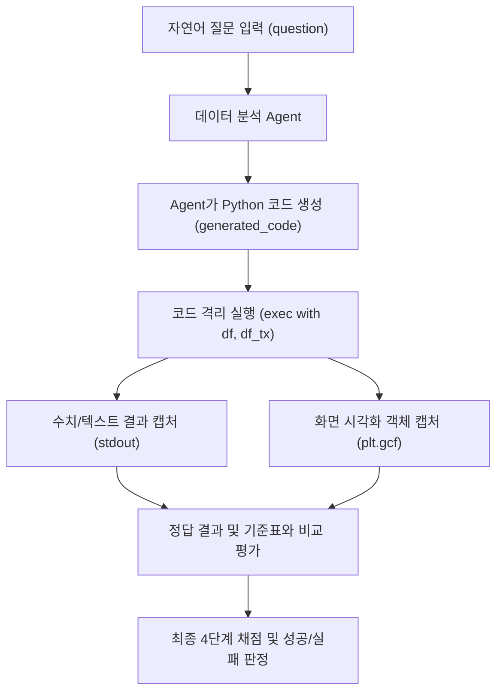

# 데이터 분석 Agent 검증용 100개 테스트 세트 사용 가이드 (USAGE GUIDE)

본 문서는 데이터 분석 Agent의 질의 이해, Python 코드 생성, 수치 집계 및 화면 시각화(표·차트) 표출 능력을 종합적으로 검증하기 위한 **100개 벤치마크 테스트 세트**의 구조, 명세 및 상세 사용법을 안내합니다.

---

## 1. 테스트 세트 개요 및 구성

데이터 분석 Agent는 자연어 질문을 해석하여 적절한 **Python 분석/시각화 코드**를 생성하고, 이를 실행하여 **화면에 표나 차트로 결과를 시각화**해야 합니다.

본 테스트 세트는 외부 환경(Databricks 등) 의존성 없이 로컬에서 즉시 100% 재현 가능한 표준 데이터셋과 10개 영역 100개의 실전 검증 문항, 그리고 자동 실행 러너를 제공합니다.

### 📁 디렉터리 구조 (`tests/analysis_benchmark_100/`)

```text
tests/analysis_benchmark_100/
├── dataset_generator.py             # 재현 가능한 벤치마크 데이터셋 생성기
├── customer_analytics.csv           # 고객 인구통계 및 금융 데이터 (1,000건, 18개 컬럼)
├── transaction_history.csv          # 거래 내역 데이터 (5,000건, 8개 컬럼)
├── test_definitions_part1.py        # 문항 정의 Part 1 (TEST_001 ~ TEST_020)
├── test_definitions_part2.py        # 문항 정의 Part 2 (TEST_021 ~ TEST_040)
├── test_definitions_part3.py        # 문항 정의 Part 3 (TEST_041 ~ TEST_060)
├── test_definitions_part4.py        # 문항 정의 Part 4 (TEST_061 ~ TEST_080)
├── test_definitions_part5.py        # 문항 정의 Part 5 (TEST_081 ~ TEST_100)
├── build_and_run_benchmark.py       # 전수 실행 및 JSON/리포트 빌더
├── run_benchmark.py                 # CLI 기반 대화형/자동화 테스트 러너
├── benchmark_cases.json             # 100개 전 문항 정의, 정답 코드, 실행 결과 JSON
├── benchmark_execution_report.md    # 100개 문항 검증 결과 리포트
└── USAGE_GUIDE.md                   # 본 사용법 안내서
```

---

## 2. 벤치마크 데이터셋 스키마

테스트 환경에는 `df`(고객 데이터)와 `df_tx`(거래 데이터) 두 개의 Pandas DataFrame이 제공됩니다.

### 1) 고객 데이터: `df` (`customer_analytics.csv`, 1,000행 × 18열)
| 컬럼명 | 타입 | 설명 및 유효값 |
|---|---|---|
| `customer_id` | object | 고객 고유 식별자 (`CUST0001` ~ `CUST1000`) |
| `age` | int64 | 고객 연령 (19세 ~ 75세) |
| `gender` | object | 성별 (`Male`, `Female`) |
| `job` | object | 직업 (management, technician, blue-collar, admin., services 등 10개) |
| `marital` | object | 결혼 여부 (`married`, `single`, `divorced`) |
| `education` | object | 교육 수준 (`tertiary`, `secondary`, `primary`, `unknown`) |
| `credit_score` | int64 | 신용점수 (350점 ~ 850점) |
| `annual_income`| int64 | 연간 소득 (달러, 직업별 차등 분포) |
| `balance` | float64 | 계좌 잔액 (마이너스 통장 음수값 및 고액 자산가 이상치 포함) |
| `housing_loan` | object | 주택담보대출 보유 여부 (`yes`, `no`) |
| `personal_loan`| object | 개인 신용대출 보유 여부 (`yes`, `no`) |
| `signup_date` | object | 서비스 가입일자 (`YYYY-MM-DD`, 2022~2024년) |
| `last_active_date` | object | 최근 활동일자 (`YYYY-MM-DD`, 2024년 하반기) |
| `device_type` | object | 주 접속 기기 (`iOS`, `Android`, `Web`) |
| `service_tier` | object | 고객 서비스 등급 (`Bronze`, `Silver`, `Gold`, `Platinum`) |
| `churn` | int64 | 이탈 여부 (`0`: 유지, `1`: 이탈) |
| `campaign_contact_count` | int64 | 마케팅 캠페인 접촉 횟수 (1회 ~ 10회 이상) |
| `satisfaction_score` | float64 | 고객 만족도 점수 (1.0 ~ 5.0, 의도적 결측치 약 5% 포함) |

### 2) 거래 내역 데이터: `df_tx` (`transaction_history.csv`, 5,000행 × 8열)
| 컬럼명 | 타입 | 설명 및 유효값 |
|---|---|---|
| `tx_id` | object | 거래 고유 ID (`TX00001` ~ `TX05000`) |
| `customer_id` | object | 거래 고객 ID (950명 활성, 50명은 거래 없음 → Anti-Join 검증용) |
| `tx_datetime` | object | 거래 발생 일시 (`YYYY-MM-DD HH:MM:SS`, 2024년 1년치) |
| `tx_type` | object | 거래 유형 (`Payment`, `Transfer`, `Withdrawal`, `Deposit`) |
| `amount` | float64 | 거래 금액 (달러) |
| `channel` | object | 거래 채널 (`Mobile App`, `Online Banking`, `ATM`, `Branch`) |
| `is_declined` | int64 | 거래 승인 거절 여부 (`0`: 정상, `1`: 거절) |
| `fee` | float64 | 거래 수수료 (입금은 0원, 기타 1.5%) |

---

## 3. 10개 검증 영역 및 100개 문항 인덱스

| 영역 번호 | 분석 카테고리 | 문항 번호 | 주요 검증 역량 |
|---|---|---|---|
| **Cat 1** | **기초 데이터 탐색 및 요약 통계** | TEST_001 ~ TEST_010 | 데이터 shape, 타입, 결측치, 기술통계, 고유값, 기본 분포 히스토그램/박스플롯 |
| **Cat 2** | **조건부 필터링 및 서브셋 추출** | TEST_011 ~ TEST_020 | 단일/복합 조건(AND, OR, NOT), `between`, `isin`, 결측치 필터링, 고액 자산가 슬라이싱 |
| **Cat 3** | **그룹 집계 및 피벗 분석** | TEST_021 ~ TEST_030 | `groupby`, 다중 집계(`agg`), `pivot_table`, 총계(margins), 교차표 백분율, 그룹 상위 1위 |
| **Cat 4** | **시계열 및 트렌드 분석** | TEST_031 ~ TEST_040 | 날짜 파싱, 이동평균(7일), 요일/시간대별 패턴, MoM 증감율, 멀티라인 추이, 누적합 |
| **Cat 5** | **범주형 데이터 및 빈도 분석** | TEST_041 ~ TEST_050 | 도수분포표, 파레토 누적 비중, 구간화(`pd.cut`/`pd.qcut`), 파이/도넛 차트, 소수 범주 감지 |
| **Cat 6** | **상관관계 및 변수 간 연관성** | TEST_051 ~ TEST_060 | 피어슨/스피어만 상관계수, 상관 히트맵, 산점도 회귀선, hue 그룹화, 공분산, 서브플롯 비교 |
| **Cat 7** | **이상치 탐지 및 분포 통계** | TEST_061 ~ TEST_070 | 왜도/첨도, IQR 울타리(Fence), Z-score 극단값, 윈저라이징(Capping), 로그 변환, 무결성 검증 |
| **Cat 8** | **비즈니스 KPI 및 세그먼트 분석** | TEST_071 ~ TEST_080 | 상대 지수(Index), 이탈율, 객단가(AOV), RFM 세분화, ARPU, 고위험 고객군, 복합 막대차트 |
| **Cat 9** | **다중 테이블 병합 및 정합성** | TEST_081 ~ TEST_090 | Inner/Left Join, Anti-Join(미거래 고객), 조인 후 그룹 집계, 주 채널 도출, 외래키 정합성 |
| **Cat 10** | **고급 화면 시각화 및 방어적 처리** | TEST_091 ~ TEST_100 | 집계 데이터 시각화 규칙(막대), 2x2 대시보드, 이중 축(Dual Y), 빈 DF 방어, KeyError 방어, 0 나누기 방어, 시계열 정렬 보장 |

---

## 4. 테스트 러너 실행 방법

가상환경의 Python 인터프리터를 사용하여 CLI 명령어를 실행합니다.

### 1) 전체 100개 문항 목록 조회
```bash
.venv/bin/python tests/analysis_benchmark_100/run_benchmark.py --list
```

### 2) 특정 문항 단건 실행 및 화면 출력 확인
```bash
# 예: TEST_026 (서비스 티어별 이탈률 막대 차트)
.venv/bin/python tests/analysis_benchmark_100/run_benchmark.py --id TEST_026

# 예: TEST_093 (이중 축 시각화)
.venv/bin/python tests/analysis_benchmark_100/run_benchmark.py --id TEST_093
```

### 3) 특정 카테고리별 일괄 실행
```bash
# 시계열 분석 문항 10건 일괄 실행
.venv/bin/python tests/analysis_benchmark_100/run_benchmark.py --category "시계열"

# 이상치 탐지 문항 10건 일괄 실행
.venv/bin/python tests/analysis_benchmark_100/run_benchmark.py --category "이상치"
```

### 4) 전체 100개 문항 전수 검증 및 리포트 재생성
```bash
.venv/bin/python tests/analysis_benchmark_100/build_and_run_benchmark.py
```
실행 완료 시 `PASS=100/100 (100.0%)` 성공률과 함께 `benchmark_cases.json` 및 `benchmark_execution_report.md`가 최신 상태로 갱신됩니다.

---

## 5. 데이터 분석 Agent 평가 파이프라인 연동 방법

본 테스트 세트를 활용하여 사용자가 개발한 LLM 데이터 분석 Agent를 평가하는 절차는 다음과 같습니다.



### 4단계 평가 채점 기준 (Rubric)

| 평가 레벨 | 검증 항목 | 세부 판정 기준 |
|---|---|---|
| **Level 1** | **문법 및 실행 안정성 (Syntax & Runtime)** | - 코드가 문법 에러(SyntaxError) 없이 실행되는가?<br>- `KeyError`, `IndexError`, `TypeError` 등 런타임 예외가 발생하지 않는가?<br>- 필요한 모듈(pandas, numpy, matplotlib, seaborn)을 올바르게 import 하는가? |
| **Level 2** | **수치 및 집계 정확성 (Metric Precision)** | - 필터 조건(연령대, 잔액 범위, 범주 등)이 누락 없이 적용되었는가?<br>- 집계 함수(`mean`, `sum`, `count` 등)가 올바른 분모와 컬럼을 대상으로 계산되었는가?<br>- 계산된 핵심 수치가 정답 벤치마크 값과 일치하는가? |
| **Level 3** | **시각화 규칙 준수 (Visualization Guidelines)** | - **집계 데이터 규칙**: 이미 GROUP BY 된 집계 데이터에 대해 히스토그램/KDE/박스플롯을 그리지 않고 **막대 차트**를 사용하였는가?<br>- **시계열 정렬 규칙**: 꺾은선 그래프(Line Plot)를 그리기 전 시간축을 오름차순으로 정렬하였는가?<br>- 그래프에 제목(Title), X축 라벨, Y축 라벨이 명시되어 있는가? |
| **Level 4** | **화면 표출 완성도 (Screen Presentation)** | - 시각화 요청 시 설명 텍스트에 그치지 않고 실제 차트(`plt.show()`, `st.pyplot()`)를 생성하였는가?<br>- 표 데이터 요청 시 서식화된 DataFrame(`print`, `st.dataframe()`)으로 출력하였는가?<br>- 텍스트/표/차트가 사용자가 한눈에 이해할 수 있도록 깔끔하게 배치되었는가? |

---

## 6. 결론 및 기대 효과

1. **완벽한 로컬 재현성**: 외부 클라우드 DB 없이도 100개 전 문항을 오프라인에서 즉시 실행하고 결과를 대조할 수 있습니다.
2. **다양한 실무 시나리오 포괄**: 단순 기초 통계부터 RFM 마케팅 분석, 시계열 이동평균, 다중 테이블 Anti-Join, 2x2 대시보드 및 결측치/빈 데이터 방어 코드까지 총망라되어 있습니다.
3. **Agent 릴리즈 게이트웨이**: 에이전트의 프롬프트나 툴 체인을 변경할 때마다 본 테스트 러너를 실행하여 회귀 버그를 즉각 감지하고 안정성을 검증할 수 있습니다.
